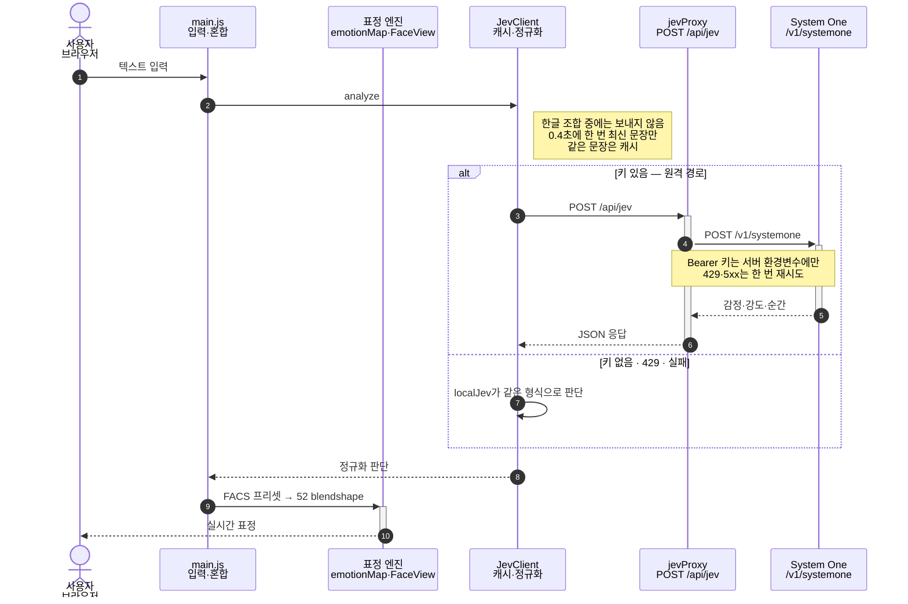

# Jev Face Lab

메시지를 입력하거나 고칠 때마다 **TypeSafe AI Jev**가 “이 메시지를 받은 사람이 느낄 감정 + 강도”를 판단하고,
사진으로 만든 얼굴 모델이 ARKit 52 blendshape 표정으로 즉시 반응하는 테스트 앱입니다.

```
텍스트 → Jev(System One) → 감정 분포 + 강도 → 표정 변환 엔진(FACS 프리셋) → 52 Blendshape → 사진 기반 얼굴 → 실시간 표정
```

## 실행 구조

한 문장을 판단할 때의 호출 순서입니다. 키 확인(`GET /api/jev/status`)은 페이지를 열 때 한 번이고, 아래는 그다음 원격 경로입니다.



`main.js`가 입력을 거른 뒤 `JevClient`가 `POST /api/jev`로 `jevProxy`에 보냅니다. 프록시만 API 키를 갖고 TypeSafe `POST /v1/systemone`을 호출합니다. 돌아온 감정·강도·순간 판단을 `emotionMap`이 FACS 프리셋으로 52 blendshape로 바꾸고, `FaceView`가 사진 얼굴에 합성합니다. 키가 없거나 429·실패면 `localJev`가 같은 형식의 판단을 만들고, 표정 이후 경로는 같습니다. 원격 호출은 한글 조합 중에는 나가지 않고, 0.4초에 한 번 최신 문장만 보내며, 같은 문장은 캐시를 씁니다.

장면별로 따라가는 상세 다이어그램은 저장소를 내려받아 [`docs/jev-execution.sequence.html`](docs/jev-execution.sequence.html)을 브라우저에서 열면 됩니다(GitHub 웹에서는 렌더링되지 않습니다). 원본 데이터는 [`docs/jev-execution.sequence.json`](docs/jev-execution.sequence.json)입니다.

## 로컬 실행

```bash
npm start            # http://localhost:5173 (포트가 사용 중이면 다음 포트로 이동)
```

`.env.example`을 `.env`로 복사해 `TYPESAFE_API_KEY`를 넣으면 Jev API 모드가 켜집니다.
키가 없으면 규칙 기반 **로컬 시뮬레이터**가 같은 형식으로 답합니다(실제 Jev 모델 아님).

## Vercel 배포

1. Vercel에서 이 저장소를 Import. 설정은 `vercel.json`에 있습니다(Framework 없음, 정적 파일은 `public/`).
2. Settings → Environment Variables에 `TYPESAFE_API_KEY` 추가.
3. 배포. 정적 파일은 루트에서, API는 `api/jev/index.js`(POST `/api/jev`)와 `api/jev/status.js`(GET `/api/jev/status`)가 처리합니다.

API 키는 서버 함수에만 있고 브라우저로 나가지 않습니다. 선택 환경변수:

| 변수 | 기본값 | 설명 |
| --- | --- | --- |
| `JEV_RATE_LIMIT_PER_MIN` | 180 | IP당 분당 Jev 호출 허용 수 |
| `JEV_GLOBAL_LIMIT_PER_MIN` | 1500 | 함수 인스턴스 전체 분당 허용 수 |
| `JEV_ALLOWED_ORIGINS` | (없음) | 추가로 허용할 Origin(쉼표 구분). 같은 도메인은 항상 허용 |
| `JEV_MAX_MESSAGE_CHARS` | 500 | 판단할 메시지 최대 길이 |
| `TYPESAFE_DEFAULT_MODEL` | `jev-latest` | 모델 |

### 호출량(측정값)

Jev 모드에서 타이핑할 때 한 사람이 보내는 호출 수입니다(가짜 응답으로 측정, 실제 API 미사용).

| 상황 | 호출 줄이기 전 | 현재 |
| --- | --- | --- |
| 사람이 타이핑(분당 250타) | 분당 233회 | 분당 108회 |
| 사람이 타이핑(분당 400타) | 분당 351회 | 분당 125회 |
| 예시 자동 입력 | 분당 155–210회 | 분당 약 120회 |

현재 방식: 한글 조합 중(끝이 낱자모)에는 보내지 않고, 계속 입력해도 0.4초에 한 번만 최신 텍스트로 보내며,
입력이 멈추면 마지막 텍스트를 한 번 더 보냅니다. 같은 문장은 캐시를 씁니다. → 사용자당 이론상 최대 분당 150회.
타이핑을 멈추면 호출은 0입니다.

요청 제한은 함수 인스턴스 메모리 기반의 최선 노력 방식입니다. 여러 인스턴스에 걸쳐 엄격하게 막아야 하면
Upstash Redis 같은 공유 저장소로 바꾸세요. 제한에 걸리면 앱은 그 입력만 로컬 시뮬레이터 결과로 보여 줍니다.

## 얼굴 모델

화면 오른쪽 위에서 모델(기본 / 모나리자)을 고를 수 있습니다. `?model=monalisa`처럼 주소로 지정할 수도 있습니다.
모델을 추가하려면 `public/assets/models/<id>/`에 배경이 투명한 `face.webp`와 랜드마크 `face-landmarks.json`을 두고
`public/src/main.js`의 `MODELS`에 `{ id, name }`을 추가합니다. 리그는 눈 사이 거리에 맞춰 자동으로 크기를 맞춥니다.

## 구조

| 경로 | 역할 |
| --- | --- |
| `public/assets/models/<id>/` | 모델별 배경 제거 사진(`face.webp`) + bake된 MediaPipe 3D 랜드마크 478점(`face-landmarks.json`) |
| `public/src/face/faceRig.js` | 얼굴 메시(눈·입 구멍, 눈 내부/구강 레이어) + ARKit 52 모프 델타 생성 |
| `public/src/face/faceView.js` | Three.js 렌더러: 델타 합성, 머리 회전, 시선(홍채) 셰이더, 홍조 |
| `public/src/jev/jevClient.js` | Jev `POST /v1/systemone` 요청/응답 정규화, 호출 간격·캐시, 로컬 대체 |
| `public/src/jev/localJev.js` | 오프라인 판단기(말줄임표·반전·부정 범위·지금 읽는 구절) |
| `public/src/expression/emotionMap.js` | 감정 → blendshape·머리 자세·안색 매핑 |
| `public/src/expression/animator.js` | 스프링 보간, 깜빡임, 시선 도약, 읽기 동작, 호흡, 놀람 반응 |
| `lib/jevProxy.mjs` | Jev 프록시(요청 제한·출처 확인·재시도) — Vercel 함수와 로컬 서버가 공유 |
| `api/jev/` | Vercel 함수 |
| `server.mjs` | 로컬 개발 서버(정적 파일 + 같은 프록시) |

개발용 도구(`tools/` 랜드마크 bake·리그 점검 페이지, `tests/`)는 저장소에 포함하지 않습니다.
